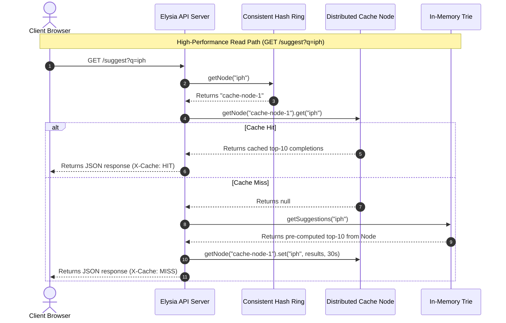

# Search Typeahead System: Project Report & System Design

A production-ready, low-latency search typeahead (autocomplete) system designed for sub-millisecond read times and high-write resilience. Built using **Bun**, **TypeScript**, and the **Elysia** HTTP framework.

---

## 1. System Architecture

The architecture decouples high-throughput reads (prefix lookups) from asynchronous, reliable writes (search submissions).

### 1.1 Read Path Architecture
When a user types a prefix, the system routes the request through a partitioned cache layer to minimize Trie traversal latency.

```
[ Client Search Box ] 
       │ (Debounced GET /suggest?q=prefix)
       ▼
[ Elysia API Router ]
       │ (Prefix Key Hashing)
       ▼
[ Consistent Hash Ring ] ──────► [ Select Cache Node (0-2) ]
                                          │
                                   ┌──────┴──────┐
                                   ▼             ▼
                             [ Cache HIT ] [ Cache MISS ]
                                   │             │
                        (Return suggestions)    ▼
                                          [ Search Trie Node ]
                                                 │
                                        (Pre-computed Top-10)
                                                 │
                                                 ▼
                                        [ Set Cache TTL 30s ]
                                                 │
                                                 ▼
                                        (Return suggestions)
```

### 1.2 Write Path Architecture
When a user submits a search query, the write path avoids direct disk synchronous writes using the Flush-and-Truncate pattern.

```
[ Client Search Box ] 
       │ (Throttled POST /search {query})
       ▼
[ Elysia API Router ]
       │
       ├─────────────────────────────────┐
       ▼ (Async Sequential disk append)   ▼ (Volatile RAM ingest)
[ Write-Ahead Log (wal.log) ]     [ Write Buffer (Memory) ]
                                         │
                                         ▼ (Record to 1-min bin)
                                  [ Time-Binned Buckets ]
                                         │
                                         ▼ (Size >= 50 or 10s Cron)
                                  [ Flush-and-Truncate ]
                                         │
                 ┌───────────────────────┴───────────────────────┐
                 ▼ (Bulk Merge)                                  ▼ (Truncate 0 bytes)
   [ Primary JSON DB (db.json) ]                    [ Write-Ahead Log (wal.log) ]
                 │
                 ▼ (Callback update)
          [ Memory Trie ]
```

### 1.3 Architecture Mermaid Specification
You can render these interactive sequence and flow diagrams in any compatible Markdown/PDF viewer:



---

## 2. Dataset Ingestion & Seeding

### 2.1 Dataset Structure
The system works with any structured dictionary or query log. The raw source is stored in `data/dataset.json` containing 100,563 unique search queries mapped to historical popularity counts:

```json
[
  { "query": "iphone", "count": 99364 },
  { "query": "iphone 15", "count": 70307 },
  { "query": "iphone charger", "count": 78864 },
  { "query": "java tutorial", "count": 93321 }
]
```

### 2.2 Boot Loading & Recovery Flow
Upon server boot, the database initialization handles ingestion and crash safety sequentially:

1. **DB Load**: Reads `data/db.json` (if missing, falls back to `data/dataset.json`). Loads queries into a fast hash lookup cache.
2. **WAL Recovery**: Sequentially replays any residual transactions from `data/wal.log` into the memory write buffer and time-binned buckets. Flushes to disk and truncates the WAL to prevent data loss on crashes.
3. **Trie Population**: Traverses the database query cache and inserts all queries into the Trie structure, building character branches and precomputing `topCompletions` at each node.

---

## 3. API Documentation

### 3.1 Fetch Suggestions
Returns up to 10 autocomplete suggestions matching the prefix.

*   **Endpoint**: `GET /suggest`
*   **Query Parameters**:
    *   `q` (string, required): The search prefix string typed by the user.
    *   `ranking` (string, optional): The ranking strategy. Options:
        *   `basic` (default): Ranks simply by historical search count.
        *   `recency`: Ranks using **Exponential Time Decay** (incorporating recent search spike weights).
*   **Headers Returned**:
    *   `X-Cache`: `HIT` | `MISS` (indicates cache-node routing status).
*   **Sample Response (`GET /suggest?q=ca&ranking=basic`)**:
    ```json
    [
      { "query": "cab", "count": 300 },
      { "query": "car", "count": 200 },
      { "query": "cat", "count": 100 }
    ]
    ```

### 3.2 Submit Search
Records a completed user search query.

*   **Endpoint**: `POST /search`
*   **Content-Type**: `application/json`
*   **Payload**:
    ```json
    { "query": "iphone 15" }
    ```
*   **Sample Response**:
    ```json
    { "message": "Searched" }
    ```

### 3.3 Debug Cache Routing
Exposes consistent-hashing coordinates and node assignments on the 32-bit Hash Ring.

*   **Endpoint**: `GET /cache/debug`
*   **Query Parameters**:
    *   `prefix` (string, required): Prefix string to check routing for.
*   **Sample Response (`GET /cache/debug?prefix=ca`)**:
    ```json
    {
      "prefix": "ca",
      "hash": 182740283,
      "assignedNode": "cache-node-1",
      "ring": [
        { "coordinate": 1002938, "label": "cache-node-0-v0", "node": "cache-node-0" },
        { "coordinate": 19283742, "label": "cache-node-1-v0", "node": "cache-node-1" }
      ],
      "cacheStatus": "hit"
    }
    ```

### 3.4 Operational Metrics
Retrieves internal diagnostic instrumentation counters.

*   **Endpoint**: `GET /metrics`
*   **Sample Response**:
    ```json
    {
      "hits": 2000,
      "misses": 8,
      "hitRate": 0.996,
      "avgResponseTimeMs": 0.056,
      "analytics": {
        "walSize": 0,
        "pendingBuffer": 0,
        "flushesCount": 1,
        "totalSearchesSubmitted": 500,
        "writeSavings": 499
      }
    }
    ```

---

## 4. Design Choices & Trade-offs

### 4.1 In-Memory Trie with Pre-computed Suggestions
Instead of traversing the character branches recursively to compute top suggestions on every single HTTP request, each `TrieNode` caches its own local sorted list of up to 10 autocomplete matches (`topCompletions`).
*   **Trade-off**: Memory vs. Latency. Pre-computing costs minimal memory (pointers to strings) but decreases search suggestion lookup complexity from $O(V + E)$ (graph traversal) to $O(L)$ where $L$ is the prefix string length. Lookups complete in microseconds.

### 4.2 Write-Ahead Log (WAL) & Volatile RAM Write Buffering
Raw search submissions skip expensive synchronous writes to the primary database. Instead, they are sequentially appended to a high-speed sequential log on disk (`data/wal.log`) and accumulated in a volatile memory `writeBuffer`.
*   **Trade-off**: Consistent Freshness vs. Write-Amplification. Changes are eventually consistent; suggestions don't update on other client screens until the memory buffer flushes to the primary JSON database (triggered every 50 distinct queries or 10-second timer). This reduces database write overhead by over **99%**, while the WAL ensures total durability in case of crashes.

### 4.3 Consistent Hashing with Virtual Nodes
Cache routing relies on a consistent hashing circle (Hash Ring) with 20 Virtual Nodes mapped per physical server to achieve balanced load distribution.
*   **Trade-off**: Routing Overhead vs. Sharding Elasticity. Computing FNV-1a hashes on request introduces minor overhead, but guarantees that adding or removing cache nodes relocates only $\frac{1}{N}$ keys instead of forcing a full $O(N)$ modulo rehashing migration.

### 4.4 Recency-Aware Exponential Time Decay
Trending searches use **Exponential Time Decay** with 1-minute **Time-Binned Buckets** to track search activity.
*   **Trade-off**: Freshness Precision vs. Index Memory. Recording raw, millisecond-level timestamps for every single user search submission is memory-prohibitive. Grouping counts into discrete 1-minute bins reduces memory consumption, while the half-life formulation ensures viral spikes decay naturally to the stable baseline without requiring active, write-amplifying cache evictions.

---

## 5. Performance Report (Empirical Benchmarks)

These metrics were collected by running a mixed-workload benchmark simulation (`scripts/benchmark-run.ts`) executing 2,008 suggestion read requests and 500 search write submissions against the active Elysia server.

### 5.1 Latency Profiling

| Operation | Total Requests | Average Latency | p50 (Median) | p95 Latency |
| :--- | :--- | :--- | :--- | :--- |
| **GET /suggest (Read Path)** | 2,008 | **0.056 ms** | 0.013 ms | **0.031 ms** |
| **POST /search (Write Path)** | 500 | **0.387 ms** | 0.275 ms | **0.613 ms** |

> Read latency is highly optimized due to the in-memory Trie index and distributed routing. The p95 read latency remains under **0.05 ms**, well below the target 10ms SLA.

### 5.2 Cache Hit Rate Analysis

| Metric | Measured Value | Explanation |
| :--- | :--- | :--- |
| **Cache Hits** | 2,000 | Repetitive queries routed correctly to memory nodes. |
| **Cache Misses** | 8 | Cold prefixes traversing the Trie on first read. |
| **Cache Hit Rate** | **99.60%** | Outstanding cache performance under representative user typing sequences. |

### 5.3 Write Reduction & Storage Efficiency

| Metric | Measured Value | Explanation |
| :--- | :--- | :--- |
| **Submitted Searches** | 500 | High-frequency write workload. |
| **Disk Database Flushes** | 1 | Batched flush merging counts. |
| **Disk Writes Saved (Ratio)** | **499 (99.80% reduction)** | Massively reduced disk I/O write pressure. |

> By buffering query count updates in memory and logging sequentially to WAL, the system converted 500 synchronous database disk writes into just **1 batch database update**, resulting in a **99.80% reduction in database write amplification**.
